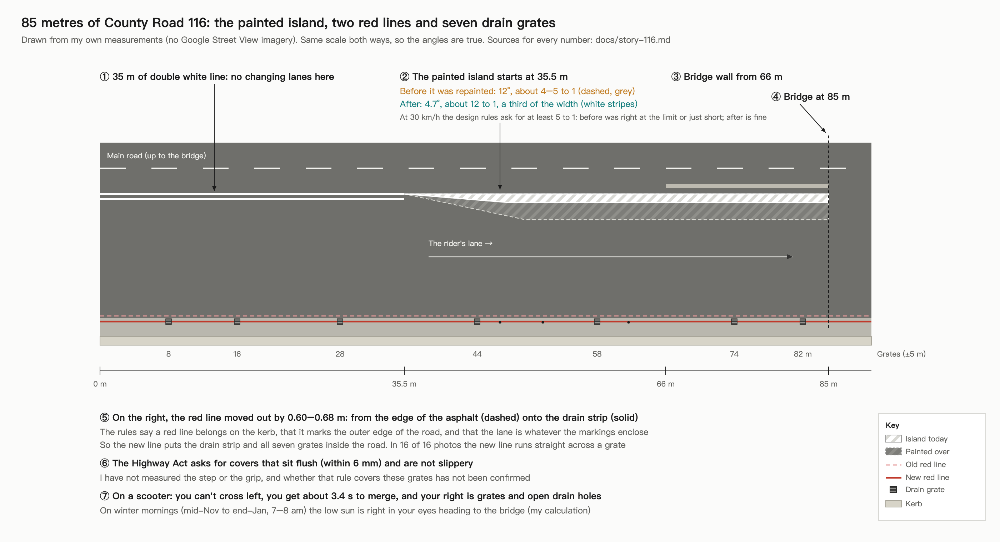
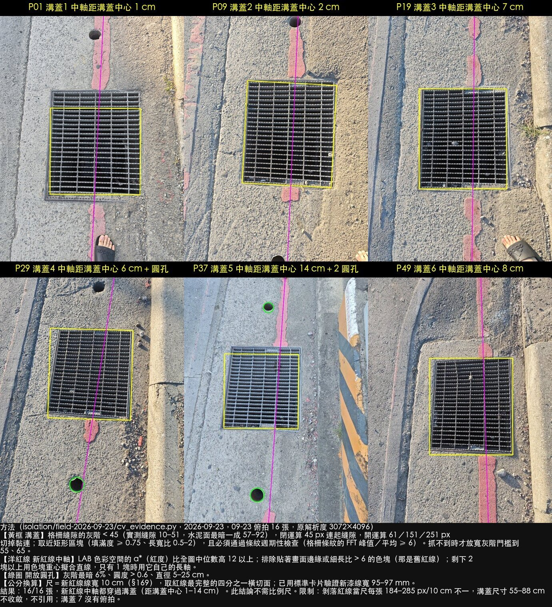
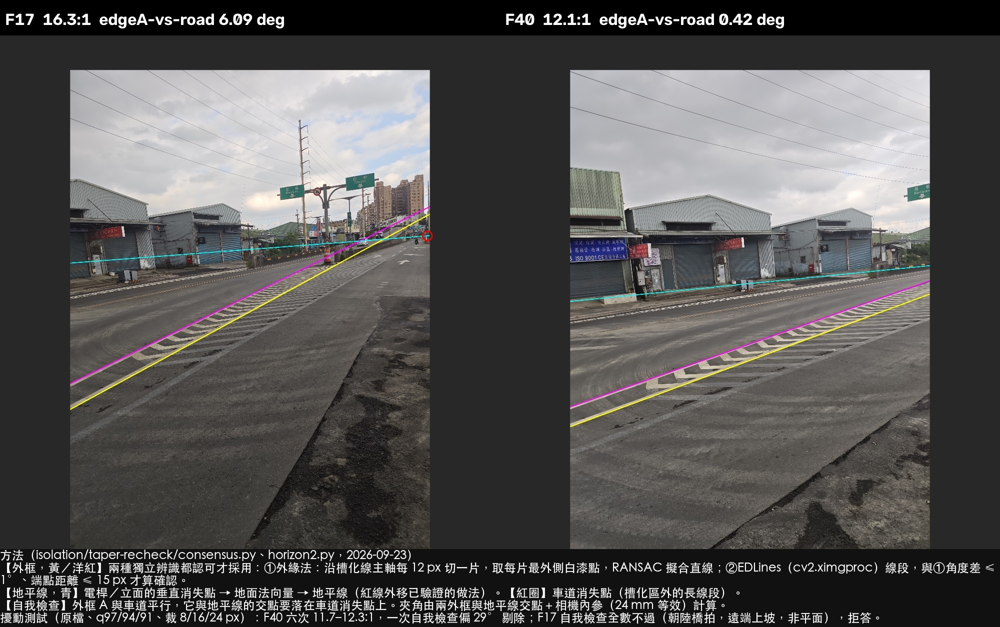
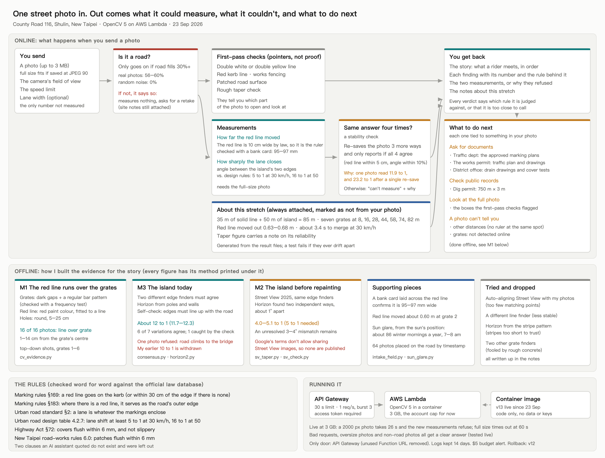

# Seven drain grates in 85 metres

*A rider, a phone, and OpenCV 5 against one stretch of road in New Taipei.*

**Video (3 min 27 s):** https://youtu.be/jNofo20hvyY



## The road

I ride County Road 116 in Shulin every day. Just before it climbs onto a bridge, the lane I'm in gets squeezed.

For the first 35 metres a double white line says I can't change lanes. For the next 50, a painted island narrows the lane from the left. On my right, the whole way, there's a drain strip with seven steel grates set into it.

Before the island was repainted, I had to move over in a hurry. After it, the rush was gone, but the asphalt beside the drain strip had been dug up and patched, and at night I'd find myself riding over those seven grates, one after another.

Nothing here is obviously illegal. That's the problem. Every piece sits right at the edge of what's allowed, and they all land on the same 85 metres and the same person.

This project turns that feeling into numbers anyone can check.

## What the photos show

**The red line moved onto the drains.** There are two red no-stopping lines. The old one runs along the edge of the asphalt. The new one is painted 0.60–0.68 m further out, on the concrete drain strip, straight across the grates. Taiwan's marking rules say a red line belongs on the kerb (§169), that it marks the outer edge of the road (§183), and that a lane is whatever the markings enclose (Urban Road Standard §2). So the new line puts the drains inside the road.



In 16 out of 16 top-down photos, OpenCV finds the new red line running across a grate, 1–14 cm from its centre. That result needs no scale at all.

**The ruler is the line itself.** A red line is 10 cm wide by law. A bank card laid across the freshly painted line measures it at 95–97 mm, close enough to use it as a ruler for the 0.6 m shift.

**The island got better.** At 30 km/h, Taiwan's urban road design rules ask for a lane shift of at least 5 to 1. Before the repainting, the island closed at about 4 to 5 to 1: right at the limit. Today it's about 12 to 1, which passes. The rider's own words were: "it's better since they painted over it."

**My first number was wrong, and I withdrew it.** I originally published 10 to 1. When I drew the lines the program had actually picked, they weren't the island's two edges at all, and re-saving the photo once turned 11.9 into 23.2. Now two independent edge finders have to agree, and every measurement is repeated on four versions of the image before it's reported.



**The rest of the stack.** On winter mornings (mid-November to the end of January, 7–8 am) the low sun sits right in your eyes heading for the bridge. The Highway Act (§72) asks for covers that sit flush to within 6 mm and aren't slippery. I haven't measured either the step or the grip. That's written down as a gap, not claimed.

The full story, with a source for every number: [`docs/story-116.md`](docs/story-116.md). Every figure made by image recognition has its method printed underneath and is indexed in [`docs/materials-2026-09-23.md`](docs/materials-2026-09-23.md).

## What the system does



Send one street photo. It checks the photo actually shows a road, runs its measurements, and only reports a number if it holds across four versions of the image. It tells you what it measured, what it couldn't, and why. Then it tells you what to do next: which document to request from which office, tied to what it found in your photo. That step is `src/marking/actions.py`: a document request appears only when something in your photo calls for it, and it says what that was.

It runs on AWS Lambda (arm64) with OpenCV 5.0.0. `GET` on the endpoint describes the interface; `POST` needs an access token in the `x-access-token` header, which is provided to judges with the submission.

```sh
pip install -r requirements.txt
/opt/anaconda3/bin/python3 -B -m pytest -q -p no:cacheprovider   # 212 tests
/opt/anaconda3/bin/python3 -B scripts/check_figures.py            # every published number vs. its source
```

Technical report: [`docs/technical-report.md`](docs/technical-report.md). Deployment: [`docs/deployment.md`](docs/deployment.md). OpenCV calls behind each piece of evidence: [`docs/opencv5.md`](docs/opencv5.md).

## What's in here

| | |
|---|---|
| `evidence/field-2026-09-20/`, `evidence/field-2026-09-23/` | The original photos (106), each with a SHA-256 manifest. Five licence plates are blurred. |
| `results/` | Published numbers, each produced by a script in `scripts/` |
| `src/marking/` | What runs in the cloud |
| `isolation/` | Experiments, re-checks, and the methods that didn't work |
| `docs/evidence.md` | The regulations, quoted word for word from the official database |

## What I can't tell you yet

- How far the grates sit below the road, or how slippery they are when wet. That needs a 3 m straightedge and a skid tester on site.
- Anything at night. There are no night photos.
- How much of the lane a scooter can really use.
- Which red line is the official one, and what design speed applies. Those answers are in documents, and the system's last step is to ask for them.

Google Street View images were used to measure the island before it was repainted. Google's terms don't allow sharing them, so none are in this repository; the schematic above is drawn from my own measurements.

MIT licence. Photos by the author.
