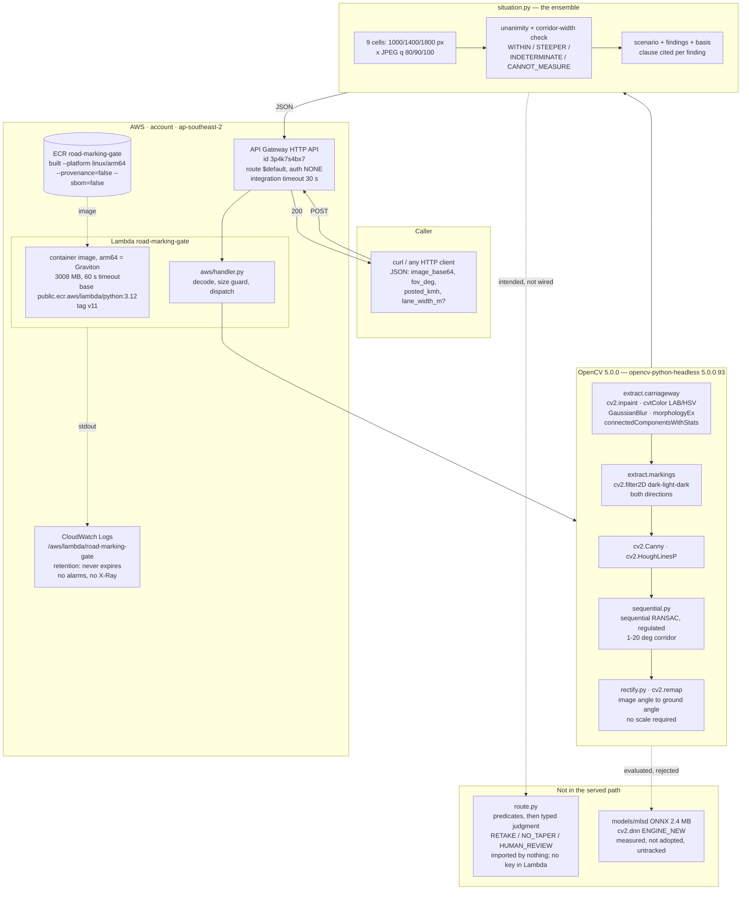

# OpenCV AI Competition 2026 — technical document

> **Self-assessment written 2026-09-21; only the checklist in §10 is kept current.** The current account is [`technical-report.md`](technical-report.md).

*`docs/figures/architecture.png` (source `architecture.svg`), redrawn 2026-09-23:
the online request path, the offline evidence pipeline, the regulations and
the deployment. It replaces the 2026-09-21 deployment diagram, which showed v11.*

2026-09-21. Written against the rubric on https://opencv26.devpost.com/,
re-read the same day. Every figure below was checked against this
repository, the running AWS account or a command rerun in this session.
Where a claim could not be checked, it is marked unverified rather than
stated.

The entry's distinguishing feature is that it declines to answer when the
answer is not supportable. A submission document that overclaims destroys
that. So the weaknesses are named in the same register as the strengths,
and several of them are severe.

**Read first, before anything else here is weighed:** on 2026-09-21 at
11:43 a defect in `carriageway()` was fixed (commit `47f08bf`). Before that
fix the function cut the chevron out of the region it searched for markings
in. Every measurement this project produced before that commit was made
through it. `docs/what-changed-2026-09-21.md` and
`docs/comparisons-2026-09-21.md` mark which results are void. The deployed
endpoint still runs the pre-fix code.

---

## 1. Architecture

One photograph in; either a statement about what a road user meets at that
place, or a refusal with a reason. Nothing between.

**The request.** A JSON `POST` carrying a base64 photograph, the lens
field of view, the posted speed limit, and optionally a lane width. Pitch,
road bearing and scale were required until 2026-09-20 and were removed:
the angle measured is invariant to camera rotation, the road's own markings
give its direction, and a taper rate is dimensionless. All three were also
the inputs that could not be established at this site, and the version that
asked for them answered INDETERMINATE to everything.

**The measurement.** `src/marking/extract.py` finds the carriageway —
asphalt is dark, unsaturated and fine-grained, and the markings are
inpainted out before the roughness test so that the paint is not mistaken
for not-road. Inside that region a matched local-contrast filter
(`cv2.filter2D`, a dark-light-dark kernel in both directions) produces the
marking mask. `cv2.Canny` and `cv2.HoughLinesP` give line segments;
sequential RANSAC in `src/marking/sequential.py` groups them into candidate
boundaries; `src/marking/rectify.py` maps an image angle to a ground angle
through a pinhole model without ever needing a scale.

**The refusal machinery.** `src/marking/situation.py` does not measure
once. It measures the same photograph nine times — three working
resolutions (1000, 1400, 1800 px) crossed with three JPEG qualities (80,
90, 100) — and reports a verdict only when every reading that survives
agrees, and only when the readings do not scatter wider than the regulated
corridor they live in. Re-encoding changes nothing about the road, so
anything the answer does across the grid is the method's own noise. That
grid is the uncertainty estimate. A split grid returns `INDETERMINATE`; a
frame the grid cannot read returns `CANNOT_MEASURE`. The guard-band
discipline is JCGM 106, and JCGM 100 §4.3.1 and F.2.4.4 are what the
project cites for treating the ensemble spread as the uncertainty rather
than a fitting residual.

**The answer.** Not a list of codes. A scenario in the order a road user
meets it, composed only from findings that were actually detected in that
frame, with `findings` carrying each one itemised with its measurement, its
regulatory clause and its own state.

**The routing module.** `src/marking/route.py` is designed to turn a
refusal into an action: retake the photograph, accept that there is no
marking present, or send it to a person. Deterministic predicates settle
what they can; a typed-judgment model is asked only about what they cannot,
and no image is sent to it — only the gate's own nine-row measurement grid.
**This module is not wired into the served pipeline.** Nothing in `src/` or
`aws/` imports it (verified by grep, 2026-09-21). See §5.

**The deployment.** A Lambda container on arm64 behind an API Gateway HTTP
API. Lambda was chosen over Fargate, App Runner and EC2 because the
workload is seconds of CPU at near-zero traffic and Lambda is the only one
that falls to zero cost while staying publicly reachable.

---

## 2. Technical execution — 30%

### What is here

**The refusal is the contribution, and it is implemented rather than
described.** Three states plus a bound, each with a `basis` naming the
document it is measured against. The nine-cell ensemble is the uncertainty
estimate, and it is computed per request at inference time, not quoted from
a validation run.

**The project reverses its own findings when the full run disagrees.** Four
times in one session a result generalised from a convenient sample was
overturned by a full-population run, and each reversal is recorded with its
n: 2000 px publication was "lossless" on 2 photographs and changes 17
findings over 42; scaled detector parameters improved the spread three-fold
on 14 and worsened it over 42 (6.3° to 9.1°); M-LSD won on the grid and
lost once letterboxed; degradation bias was dramatic on 4 and is +0.76° on
22. `docs/comparisons-2026-09-21.md` is a register of every comparison run
and whether it holds.

**Provenance is mechanical.** `results/figure_registry.json` pins each
published figure to an RFC 6901 pointer into the file that produced it,
with an `expect` block on a neighbouring value so a mis-aimed pointer fails
instead of passing. Run in this session: `scripts/check_figures.py` reports
*7 published figures match their sources*, exit 0. Withdrawn figures are
kept in the file, out of `figures`, so the record shows what was claimed and
what happened to it.

**Tests.** `/opt/anaconda3/bin/python3 -m pytest tests/ -q` — 32 passed,
run 2026-09-21. Two of them were added because the only code path that
reports a verdict raised `KeyError` and 41 of 42 photographs refuse, so no
test had ever exercised it.

### What is not here, and it is not small

**The pipeline's core measurement is not reproducible, and the project says
so.** The taper angle moves by more than its own magnitude when the same
photograph is saved at a different JPEG quality. `results/taper_vanishing.json`
and `results/taper_rate.json` were withdrawn on 2026-09-21 for that reason.
This is the headline quantity the project was built around.

**After the `carriageway()` fix the measurement got worse.** Over 42
photographs: line segments median 50 → 157, photographs with two or more
readings 27 → 42, median angle spread **6.3° → 14.2°**, photographs under
5° spread **9 → 0**. Three times the signal and twice the disagreement.
The likely explanation — that the defect was working as an accidental
filter, discarding the chevron and leaving the long stable lane and kerb
lines — is a story, not evidence. It is written down as a story.

**Every detector comparison this project ran is void.** LSD,
FastLineDetector, MSAC, linear parameter scaling and M-LSD were all
compared on input that had lost most of its marking pixels. Those negatives
do not disprove the detectors. They are untested, not beaten.

**The ensemble never measures the original photograph.** The originals are
3072×4096; the grid tops out at 1800 px. The regulation is written in
centimetres — §171 gives a 20 cm stripe and a 30 cm gap; the tolerance on
marking width is ±6 mm, which is 0.85 px in the original and 0.21 px at
1000 px. A conformity check against those numbers is only conceivably
possible on the original, in the near field, and it is not being taken.

**There is no held-out evaluation and no ground truth for the taper.** The
project's own evaluation rule — beat predicting the training mean, on
subjects not fitted on — has not been applied to the taper measurement,
because there is no measured truth for the site. What exists is a
reproducibility study, which is a different and weaker thing.

**`docs/thesis.md` still quotes withdrawn figures.** Its evidence table
gives 11.4° and 27.8 km/h; both are in `withdrawn_figures` in the registry.
`check_figures.py` validates registry entries, not prose, so it does not
catch this. The same file's OpenCV table lists `cv2.dnn` segmentation,
`findContours` with convexity defects and `warpPerspective`; none of the
first two appear anywhere in `src/`, and `warpPerspective` appears only in
`scripts/birdseye.py`, not in the served path. That table describes intent,
not implementation.

### OpenCV 5 specifically

`docs/opencv5.md` states which OpenCV 5 features this build exposes and
which it does not, feature by feature. Most of the release is inapplicable
here, and the document says so instead of putting OpenCV 5 API names in the
source to be able to list them. Two are real:

- **The new DNN engine works.** `cv2.dnn.readNet(path, "", "",
  cv2.dnn.ENGINE_NEW)` loads the 2,485,936-byte ONNX M-LSD model in
  `models/mlsd/`. Timed in this session on the local arm64 host: forward
  pass at 512×512, median **36.8 ms** over five runs after a warm-up
  (35.0–40.4 ms). `docs/opencv5.md` records 49 ms for the same operation;
  the difference is not explained here, and the 49 ms figure should not be
  quoted without saying which measurement it came from. **M-LSD is not in
  the pipeline.** It was measured and it lost once letterboxed — 20 of 42
  photographs with two or more readings against 27, median spread 7.3°
  against 6.3°. That comparison also predates the `carriageway()` fix, so
  it is void as a verdict on M-LSD.
- **NEON dispatch is live.** `cv2.getCPUFeaturesLine()` returns
  `NEON FP16 NEON_DOTPROD NEON_FP16 *NEON_BF16`, verified in this session.
  **This was verified on the local Apple-silicon host, not on Graviton.**
  The deployed function does not return its CPU feature line, so the Arm
  dispatch on Lambda is inferred from the architecture, not observed. See
  §4.

---

## 3. Innovation — 20%

The criterion is originality and thoughtful use of computer vision **or**
AI. It does not require both.

**What is original.** Not the detector. The detector is Canny and Hough,
deliberately: the regulation is geometry, so every line the system acts on
can be drawn back for a person to argue with, and a neural verdict cannot
be argued with. What is original is applying JCGM 106 conformity assessment
under measurement uncertainty to street imagery, and treating a
perturbation ensemble as the uncertainty estimate at inference time. The
adjacent published work on sidewalk width from street imagery reports a
mean absolute error of 0.252 m and no verdict error rate; on the only
dataset with field-measured truth, 34.6% of real sidewalks sit within half
a metre of the 1.5 m threshold, inside twice that error. Those cases all
get an answer, and some of those answers are wrong, and the method cannot
say which. Reporting the metre instead of the verdict is the gap.

**The measured contribution to that claim is negative so far.** This
project demonstrated the problem on itself rather than solving it: the
ensemble shows that its own headline measurement does not survive
re-encoding, and the response was to withdraw the number, not to publish it
with a wider error bar. That is an honest result, and it is a result about
this method, not a general method other people can pick up yet.

**Where a model is used it is used narrowly.** `route.py` asks a
typed-judgment model exactly one question, over the gate's own numbers, with
no image sent, after deterministic predicates have taken everything they
can. Redesigning that question — giving the model the nine-row grid instead
of eight aggregate counts, and removing `unclear` as an option because it is
a state of the model and not of the road — moved median confidence from the
0.22–0.36 band, where chance on a four-way choice is 0.25, to 0.91 over
eleven photographs. That finding is real and it is recorded with the counts.

**Weakness.** The finding above was produced by an offline harness that is
not in the repository (see §5), so a judge cannot rerun it. And the router
is not deterministic: F17 returned 0.65 on one run and 0.59 on the next,
either side of the threshold that decides whether a person is asked. The
measurement is averaged over an ensemble; the routing decision on top of it
is not, and it should be.

---

## 4. Real-world impact — 20%

**The problem is real and the regulation is specific.** Taiwan's
《道路交通標誌標線號誌設置規則》 fixes a 20 cm stripe and a 30 cm gap for
chevron hatching (§171), a 10 cm kerbside red line (§169), and double white
lines that forbid a lane change (§167). 《市區道路及附屬工程設計標準》第 16 條
fixes sidewalk clear width at 1.5 m, 1.2 m, or 0.9 m by case. New Taipei's
own excavation rules fix a ±0.6 cm step at a new-to-old pavement joint,
±0.3 cm in a no-dig zone, and state the instrument: a 3 m straightedge.
These are numbers. Nobody is checking them at city scale, because checking
one road means sending a person with a tape.

**There is evidence of harm at the study site, and it is pinned.** 116 縣道
樹林中正路, within 250 m of 25.0026917, 121.4237431, from `data.gov.tw`
datasets 12197 and 13139: 12 A2 injury accidents in the 12 months before
works began (1.00/month) against 21 in the first 8 months of 2026
(2.62/month). National A2 volume over the same comparison moves 1.04, so it
is not a reporting change. Poisson one-tailed p = 0.00016 against an
expected 8.3. All four figures are registry-pinned and pass
`check_figures.py`.

**What that evidence does not establish.** It is one site, and it is
correlation with a construction period, not with any marking geometry this
system measures. The project's own before-and-after on the marking change
of 2026-05 is 12 accidents in 4 months against 8 in 3, which says nothing in
either direction, and the document says so. No causal claim from the
accident data to the taper is made, and none is supportable.

**The tool has not been used by anybody yet.** No agency has run it, no
inspection workflow consumes it, and the one endpoint has no user other than
its author. The "evidence of potential benefit" the criterion asks for is
the regulation's own specificity plus the accident series, not usage.

**The generalisation claim is weak on purpose.** The thresholds are
Taiwan's, the training-side dataset available with field-measured truth
(Zenodo 22699523, 513 photographs, CC0) is Seoul's, and that mismatch is
stated rather than papered over. The 42 field photographs published in
`evidence/field-2026-09-20/` are one road on one afternoon.

---

## 5. User experience — 10%

**What exists.** One HTTP endpoint. `GET` returns a full description of the
request schema, the finding codes with their clauses, the four states and
what each means, and the three inputs that are explicitly *not* needed with
the reason for each. `POST` returns a scenario written for a person, not a
list of codes — what a road user meets, in the order they meet it — and
`findings` alongside it carrying the same content itemised with each
measurement, its clause and its state. A `not_checked` array names every
check that did not produce a finding *and why*, including checks that were
removed because they misfired.

**Measured this session**, 2026-09-21, against the live endpoint:
`IMG_20260920_155843.jpg` downscaled to 1500 px, q85, `fov_deg` 60,
`posted_kmh` 50. HTTP 200 in **31.1 s** wall clock. Taper
`INDETERMINATE` — 6 readings of 9, median 14.76°, range 11.52–27.61°,
with the stated reason *"All 6 agree, but they would agree on any value in
that range, so the agreement carries no information"*. One finding asserted,
`SURFACE_IN_PIECES`, 4 pavement types, with the ±0.6 cm clause as its basis
and an explicit note that pavement count is not a height difference.

**Weaknesses, all of them user-facing.**

- **31 s for one photograph**, against an API Gateway integration timeout of
  30 s. That request returned 200; a slower one will not. There is no
  progress signal and no asynchronous mode. This is the most likely thing to
  fail in front of a judge.
- **There is no interface.** No web page, no file upload, no visualisation
  of the lines the gate chose. The response includes the candidate list with
  its hatching evidence, which is the right content for arguing with the
  verdict, but the caller must read JSON to see it. For a system whose
  entire argument is auditability, not drawing the chosen boundary back onto
  the photograph is a real gap.
- **The caller must supply `fov_deg`.** It is in the EXIF of every field
  photograph and the manifest carries it; the endpoint does not read it.
- **The scenario is Traditional Chinese only.** Correct for the audience and
  a barrier for judging.
- **Payload handling is documented rather than defended.** The handler caps
  an image at 3 MB and explains why; the cap never fires, because API
  Gateway returns its own `413` first, with no reason a caller can act on.
  A 4.81 MB photograph becomes 6.41 MB encoded and is turned away by AWS.
  Callers must downscale to about 2000 px and nothing tells them so at the
  moment of failure.
- **Accessibility has not been considered at all.** There is no interface to
  make accessible, which is not the same as having done the work.

---

## 6. Documentation and presentation — 10%

**What exists.** 24 documents in `docs/`, including the source text of three
regulations verbatim; an evidence register pinning each quoted clause to its
source file; `docs/reproducibility-2026-09-21.md`, which withdraws the
project's headline measurement and says why; `docs/what-changed-2026-09-21.md`,
which records the `carriageway()` defect and that the fix made the
measurement worse; and `docs/comparisons-2026-09-21.md`, a register of every
comparison run with a verdict on whether each still holds. `AGENTS.md` states
the interpreter, the thresholds with their legal sources, the dataset with
its licence, the evaluation rule and the claim rule. Commit messages carry
the measurement that motivated the commit.

**What is missing or wrong.**

- **No video.** Nothing in the repository. The submission requires one of at
  most five minutes showing team, application, architecture and results.
- **This file is the first architecture diagram.** There was no Mermaid, no
  `.drawio` and no image of the architecture anywhere in the repository
  before it.
- **The judge-accessible repository is five commits behind local.**
  `github.com/jiarong0423/road-marking-conformity` is public (HTTP 200 on
  the API, `private: false`) and `origin/main` is at `a429e8c`, while local
  `HEAD` is `a5e6f24` (state at 11:50, 2026-09-21; the repository was being
  committed to while this was written). The five commits not yet pushed
  include the 42 field photographs, the MIT licence, the verdict-path crash
  fix, the `carriageway()` fix and the M-LSD outcome. A judge reading the
  repository today gets a project with no primary evidence, no licence and
  the defect still in place.
- **Two things a judge would need are untracked:**
  `docs/comparisons-2026-09-21.md` and the whole of `models/`, which holds
  the ONNX file and its Apache-2.0 licence. `git status` shows both as `??`,
  along with this file.
- **`scripts/check_stage.sh` has been replaced in the working tree** by a
  two-line shim to a workspace-level security gate outside this repository.
  The project's own pre-commit guard — the figure-registry check, the
  credential-shaped-filename refusal, the large-file refusal — is what the
  committed version does, and it is not what currently runs. The change is
  uncommitted.
- **`docs/deployment.md` is stale on the two facts a judge will check.** It
  states 2048 MB and image `v2`; the live function is 3008 MB and `v11`.
- **`evidence/field-2026-09-20/README.md` says the largest single file is
  under 5 MB.** From `MANIFEST.csv`: 42 files, 210.3 MB total, largest
  7,899,011 bytes.
- **Dependencies are half-pinned.** `requirements.txt` pins
  `opencv-python==5.0.0.93`, `numpy==2.4.4`, `scipy==1.17.1`.
  `aws/Dockerfile` pins `opencv-python-headless==5.0.0.93` but installs
  `numpy>=2.0` unpinned, so the image is not reproducible across rebuild
  dates. The submission asks for pinned dependencies.
- **The document set contradicts itself in places** — `docs/thesis.md`
  quotes withdrawn figures (§2). A reader cannot currently tell which
  document is current without the dates.

---

## 7. Cloud delivery, reproducibility and responsible operation — 10%

### Verified state of the deployment, 2026-09-21

| | |
|---|---|
| account / region | <account>, ap-southeast-2 |
| function | `road-marking-gate`, `PackageType: Image` |
| architecture | **arm64** — Graviton |
| memory / timeout | 3008 MB / 60 s |
| image | `<account>.dkr.ecr.ap-southeast-2.amazonaws.com/road-marking-gate:v11` |
| last modified | 2026-09-20T17:27:54Z |
| role | `road-marking-gate-role`, basic execution only |
| entry | API Gateway HTTP API `3p4k7s4bx7`, `$default` route, `AWS_PROXY`, 30 000 ms |
| OpenCV | `opencv-python-headless==5.0.0.93`, reported by the running function as `5.0.0` |

### What is done well

Least privilege on the execution role: basic execution only, no data
services attached, nothing else in the account. The build is a single
script, `aws/build-and-push.sh`, with the two non-obvious flags
(`--provenance=false --sbom=false`, or Lambda refuses the manifest) in the
script rather than in a person's memory. **No image is ever sent to a
third-party model** — `route.py` sends numbers only, and says so in the
answer it returns. Photographs stay inside the function.

### What is missing, and this is the weakest rubric line after §5

- **No infrastructure as code.** No CloudFormation, SAM, CDK or Terraform.
  The function, the role, the API and the route were created by hand with
  CLI commands recorded in prose. The stack cannot be recreated from the
  repository, which is what "repeatability" asks for.
- **Observability is the default and nothing more.** CloudWatch log group
  exists with **retention `null` — logs never expire**. `storedBytes: 0`.
  `DetailedMetricsEnabled: false` on the stage, **no access logging**, X-Ray
  tracing `PassThrough` (off), and **zero CloudWatch alarms in the account**.
  There is no structured logging, no request id echoed to the caller, and no
  way to find out after the fact what a given request did.
- **The endpoint is open and unthrottled.** `AuthorizationType: NONE`, no
  API key, no WAF, no reserved concurrency, no per-route throttle. Anyone
  can run 31 s of 3008 MB compute, repeatedly. The cost exposure is real
  even if the traffic today is one caller.
- **The deployed image predates the `carriageway()` fix.** `v11` was last
  modified 2026-09-20T17:27:54Z, which is 2026-09-21 01:27 local. Nine
  commits have landed since, including the fix at 11:43. **The live endpoint measures through
  the defect**, and the response I recorded in §5 was produced by the
  defective code. It also predates the verdict-path `KeyError` fix, so a
  photograph that actually asserts a taper may crash the live function. That
  has not been tested against the live endpoint and should be before
  submission.
- **The responsible-use story is unwritten.** The `GET` description does not
  say that a verdict from this system is not an inspection, does not bind
  anybody, and is measured against a document (施工之交通管制守則) whose
  applicability to a 縣道 the project itself records as unestablished. The
  code carries `basis` on every finding, which is the mechanism for saying
  it; the endpoint does not say it in words.
- **No rollback path is written down** beyond re-running
  `update-function-code` with an older tag, and the tags are not pinned to
  commits anywhere.

---

## 8. Best Use of COOL — $1,000

Requirement, as stated: COOL must execute the claimed core workload on AWS
Graviton or the Arm component of a documented hybrid architecture, with
reproducible measurements against baselines.

### Satisfied, and verifiable by a judge

The core workload runs on Graviton. `aws lambda get-function-configuration
--function-name road-marking-gate` returns `Architectures: ["arm64"]`, which
on AWS is Graviton. The image is built with `--platform linux/arm64` in
`aws/build-and-push.sh`. The whole measurement runs inside that function;
nothing is offloaded. `cv2.getCPUFeaturesLine()` returns
`NEON FP16 NEON_DOTPROD NEON_FP16 *NEON_BF16`, so NEON dispatch is live
rather than assumed.

### Not satisfied, and it is most of the award

1. **The CPU feature line has been verified on an Apple-silicon host, not on
   Graviton.** The running function does not report it. Until the handler
   returns it, the Arm dispatch inside Lambda is an inference from the
   architecture flag.
2. **There is no measurement against a baseline.** None. The award's second
   half is entirely absent.
3. **Whether this is "COOL" at all is unestablished.** The image installs
   the stock `opencv-python-headless` wheel from PyPI. It does not install
   anything distributed as the Cloud-Optimized OpenCV Library.
   `docs/status-2026-09-20.md` records two irreconcilable accounts of what
   COOL is — a package for this AWS integration, and an AWS Marketplace AMI
   that cannot go in a Lambda — and says nothing depends on either. **Before
   any benchmark is run, this has to be settled**, because a benchmark of
   stock OpenCV on Graviton against stock OpenCV on x86_64 answers a
   different question from the one the award asks.

### The benchmark that would close item 2, precisely enough to run

Assuming item 3 resolves such that the shipped build qualifies. If it does
not, the same harness applies with the COOL build as the arm64 arm.

**Subjects.** All 42 photographs in `evidence/field-2026-09-20/`, originals,
3072×4096, identified by the SHA-256 in `MANIFEST.csv`. Verify the hashes on
both hosts before timing, so that the two arms are provably reading
identical bytes.

**Arms.** Two Lambda functions in account <account>, region
ap-southeast-2, from the same `aws/Dockerfile` and the same git commit:

- `road-marking-gate-bench-arm64` — built `--platform linux/arm64`,
  `Architectures: ["arm64"]`
- `road-marking-gate-bench-x86` — built `--platform linux/amd64`,
  `Architectures: ["x86_64"]`

Both at 3008 MB and 300 s. Pin `numpy` to an exact version in the Dockerfile
first, or the two arms may not get the same numpy. Record the resolved
version of every installed package from both images (`pip freeze`) into the
result file.

**Invocation.** Direct `aws lambda invoke`, not through API Gateway, so the
30 s integration timeout does not truncate the sample and gateway latency
does not enter the measurement.

**Unit of work.** Two timings per photograph, both taken inside the handler
with `time.perf_counter()` and returned in the response body:

- `t_ensemble` — the full nine-cell `taper_ensemble()` call. This is the
  claimed core workload.
- `t_cells` — a list of the nine per-cell times, so a judge can see which
  stage the difference comes from.

Do not time the base64 decode or the JSON serialisation.

**Protocol.** Per photograph per arm: 1 warm-up invocation, discarded, then
9 timed invocations. Sequential, no concurrency, so the two arms are not
competing for the same Lambda scaling behaviour. Total 42 × 10 × 2 = 840
invocations. Record the function's `$LATEST` image digest and Lambda request
id with every timing.

**Statistic.** Per photograph, the median of the 9. Across photographs, the
median of the per-photograph medians, plus the full distribution of the
per-photograph ratio arm64 ÷ x86_64. Report the ratio's median and its
2.5th and 97.5th percentiles from a 10 000-draw bootstrap over the 42
photographs. Report how many of the 42 favour each arm, because a median
ratio with 20 of 42 going the other way is a different result from one with
40 of 42.

**Correctness gate, and this is not optional.** For each photograph, the two
arms must return the same verdict state and the same finding codes. A speed
result is meaningless if the arms disagree about the road. Report any
disagreement as a finding in its own right, and report the numeric
difference in `taper_deg_median` where both produce one; floating-point
differences between architectures are expected and their size is worth
knowing.

**Cost.** Report GB-seconds per photograph for each arm and the price
difference at the published per-GB-second rates for the two architectures in
ap-southeast-2, since Graviton's price advantage is separate from its speed.

**Outputs.** `results/cool_benchmark.json` carrying every raw timing, both
image digests, both `pip freeze` outputs, the 42 SHA-256 hashes and the
commit. Registered in `results/figure_registry.json` with an `expect` block,
so the quoted speedup fails the pre-commit check if the file changes.
`scripts/cool_benchmark.py` runs it end to end from one command.

**Estimated cost.** 840 invocations × roughly 30 s × 3008 MB is about
75 000 GB-seconds, a few US dollars. Not a constraint.

---

## 9. Agentic Vision — $1,000

Requirement, as stated: image or video results must influence a subsequent
plan, tool call, action or request for human approval. Explaining a fixed
result is explicitly not enough.

### What `route.py` already does

It is built for exactly this criterion, and the design is sound.

The gate produces a nine-row grid from the photograph: per encoding, the
line-segment count, how many candidates fell inside the regulated corridor,
how many bordered hatching, and the angle if one was obtained. When the grid
will not yield a verdict, `route_ensemble()` decides what to do about the
photograph, in four documented actions: `RETAKE`, `NO_TAPER`,
`HUMAN_REVIEW`, `MODEL_UNAVAILABLE`.

Deterministic predicates go first and settle what they can: not a road
photograph, no carriageway found, no candidate in the corridor in any
encoding, no candidate bordering hatching in any encoding. Over the 42
photographs the predicates settle 9 and pass 33 to the model. Only the
remaining case — the evidence exists and disagrees with itself — is asked,
and it is asked as one typed `Choice` over three physical states of the
photograph, with `what` and `not_for` on each. No image is sent; the state
is the gate's own numbers, and the returned answer says so. Anything at or
below 0.6 confidence goes to a person, because chance on the original
four-way question was 0.25 and the inherited 0.4–0.6 abstain band would have
passed a 0.19 answer through as decisive.

Redesigning the question raised median confidence from 0.22–0.36 to 0.91
over eleven photographs. F22's grid — nothing at 1000 px, every cell at
1400 px, falling away at 1800 — is read as an inadequate photograph at 0.92,
which is what that pattern means.

### What would have to change, and it is more than polish

1. **Wire it in.** `route.py` is imported by nothing. Verified by grep over
   the whole repository on 2026-09-21: the only non-documentation file
   mentioning `route_ensemble` is `route.py` itself. `situation.assess()`
   does not call it and `aws/handler.py` does not call it. The live POST
   recorded in §5 returned no routing action. As shipped, the vision result
   drives nothing.
2. **Give the deployed function a key.** `Environment` on the Lambda is
   `null`, so `TYPESAFE_API_KEY` is unset and `_route_grid` would return
   `MODEL_UNAVAILABLE` even if it were called. The key must reach the
   function through a secrets store, not an environment variable in a public
   repository.
3. **Publish the harness that produced the numbers.** The 38 `CANNOT_MEASURE`
   / 3 `INDETERMINATE` / 1 `STEEPER_THAN_REFERENCE` split over 42
   photographs, the 9-settled-by-predicate count, and the 0.22 → 0.91
   confidence table are all quoted in `docs/reproducibility-2026-09-21.md`
   and produced by a script that is not in the repository. A judge cannot
   rerun any of it. This is the single largest gap for this award, because
   the evidence for the claim is currently unreproducible.
4. **Make the routing decision as stable as the measurement.** F17 returned
   0.65 and then 0.59 on the same input, straddling the threshold that
   decides whether a person is asked. The ensemble averages the measurement
   over nine encodings; nothing averages the router over repeats. Run the
   routing question k times and require agreement, exactly as the
   measurement does, or the action taken is not reproducible even when the
   measurement is.
5. **Re-measure after the `carriageway()` fix.** Every routing figure above
   was produced through the defect. Post-fix the grid is denser — readings
   median 2 of 9 to 7 of 9 — which changes both the predicate hit rate and
   what the model sees. The numbers must be regenerated before they are
   quoted to a judge.
6. **Close the loop on `RETAKE`.** The action the criterion most clearly
   rewards is the one this system is best placed to take: tell the caller
   what is wrong with the photograph and what to do differently — closer,
   lower, more of the near field — and accept the new photograph in the same
   session. Today `RETAKE` is a string in a response nobody receives.

Items 1, 2 and 6 are a day's work. Item 3 is the one that decides whether
the claim is judgeable at all.

---

## 10. Submission checklist

| requirement | state | what is missing |
|---|---|---|
| Technical report: problem, users, architecture, implementation, deployment, evaluation | **yes (2026-09-23)** | [`technical-report.md`](technical-report.md) covers all six |
| Public or judge-accessible repository | **yes** | `github.com/jiarong0423/jiarong0423-road-marking-conformity`, public, single-lineage snapshots of this repository (working history kept private) |
| Pinned dependencies | **yes** | `requirements.txt` pinned; `aws/Dockerfile` pins opencv-python-headless 5.0.0.93 and numpy 2.5.3 (the tested image) |
| Clear instructions | **yes** | README (install, tests, figure check); `deployment.md` status table current as of 2026-09-23 |
| Architecture diagram showing OpenCV 5 and AWS components | **yes** | `figures/architecture.png`, redrawn 2026-09-23 |
| Working web endpoint | **yes, limited** | v12 live at 3008 MB (2026-09-23): GET 200; a 2000 px photo 25.6 s with the new measurements refusing; a full-size photo times out at 60 s. 10 GB memory pending. Optional access token built, not yet enabled |
| Evaluation evidence including failure cases | **strong on failures, weak on ground truth** | `docs/reproducibility-2026-09-21.md`, `docs/what-changed-2026-09-21.md`, `docs/comparisons-2026-09-21.md`, `results/figure_registry.json` with its withdrawn section; no held-out set, no measured truth for the taper |
| Video, maximum five minutes, showing team, application, architecture, results | **yes (2026-09-23)** | https://youtu.be/jNofo20hvyY, 3 min 27 s, voiceover and burned-in subtitles |
| Tests | **yes** | 212 pass (2026-09-23) |
| COOL: core workload on Graviton | **yes** | arm64 verified against the live function |
| COOL: reproducible measurement against a baseline | **absent** | §8 specifies the benchmark |
| COOL: uses the Cloud-Optimized OpenCV Library | **unestablished** | stock `opencv-python-headless` wheel; what COOL is has not been settled (§8 item 3) |
| Agentic Vision: vision result drives an action | **wired, advisory** | `src/marking/actions.py` runs inside `assess()`; document requests appear only when a finding calls for them. `route.py` is still unused |
| Licence | **yes** | MIT, in the public repository |
| Primary evidence published | **yes** | 106 originals (42 + 64) with SHA-256 manifests, in the public repository |

### The shortest path to a complete submission

1. Push. Five commits, including the evidence and the licence, exist only
   locally. Nothing else on this list matters until a judge can see them.
2. Track `docs/comparisons-2026-09-21.md`, `models/` and this file.
3. Rebuild and deploy `v12` from the post-fix commit, and test a photograph
   that asserts a taper against the live endpoint — that path has never run
   in production and crashed in local code until 08:15 today.
4. Decide what the ensemble does about the original-resolution gap, and say
   so, even if the answer is that it is left open.
5. Restore `scripts/check_stage.sh` or state that the workspace gate replaces
   it.
6. Fix `docs/deployment.md` (2048 MB → 3008 MB, v2 → v11), the withdrawn
   figures in `docs/thesis.md`, and the file-size claim in
   `evidence/field-2026-09-20/README.md`.
7. Record the video.
8. If time remains: wire `route.py` in and publish its harness (§9), then the
   COOL benchmark (§8).

---

## Verification record

Checked in this session, 2026-09-21, on the machine that runs the project:

- `aws lambda get-function-configuration` and `get-function` — arm64,
  3008 MB, 60 s, image tag `v11`, last modified 2026-09-20T17:27:54Z, role
  `road-marking-gate-role`, `Environment: null`, `TracingConfig: PassThrough`
- `aws apigatewayv2 get-apis / get-integrations / get-routes / get-stages` —
  `3p4k7s4bx7`, `$default`, auth `NONE`, `AWS_PROXY`, 30 000 ms, no access
  log, detailed metrics off, no CORS
- `aws logs describe-log-groups` — retention `null`, `storedBytes: 0`;
  `aws cloudwatch describe-alarms` — 0 alarms
- `GET` and `POST` against the live endpoint — 200 and 200, the POST result
  quoted in §5
- `cv2.__version__` 5.0.0; `cv2.getCPUFeaturesLine()`
  `NEON FP16 NEON_DOTPROD NEON_FP16 *NEON_BF16`; `platform.machine()` arm64
- `cv2.dnn.readNet(..., ENGINE_NEW)` on `models/mlsd/mlsd_tiny_512.onnx`
  (2 485 936 bytes) — forward at 512×512, median 36.8 ms over 5 runs
- `pytest tests/ -q` — 32 passed
- `scripts/check_figures.py` — 7 published figures match, exit 0
- `git log`, `git status`, `git ls-remote origin` — local `a5e6f24`,
  `origin/main` `a429e8c`, untracked `docs/comparisons-2026-09-21.md` and
  `models/`; modified `scripts/check_stage.sh`. The repository was being
  committed to during this session; `docs/opencv5.md` was untracked when
  first read and is tracked as of `a5e6f24`.
- GitHub API — repository exists, `private: false`
- `grep` over the repository for `route_ensemble`, `cv2.dnn`,
  `findContours`, `warpPerspective`, `inpaint`
- `MANIFEST.csv` — 42 files, 210.3 MB, largest 7 899 011 bytes
- https://opencv26.devpost.com/ — rubric weights, both side awards,
  submission requirements, deadline 2026-10-26

Not checked, and therefore not claimed: anything requiring a full pipeline
run over the 42 photographs. Every such figure in this document is quoted
from the repository's own records with its source named, and the post-fix
figures in §2 come from `docs/what-changed-2026-09-21.md` and commit
`47f08bf`, not from a rerun in this session.
