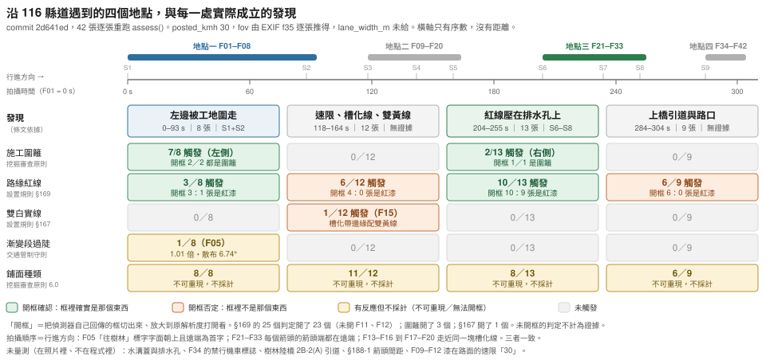

# 沿這條路遇到的四個地點

2026-09-22。量測跑在 commit `2d641ed`。這份文件把 42 張照片按**拍攝順序**排成
用路人會遇到的次序，逐段寫出當幀量到什麼、把偵測器的框打開到原解析度看到什麼、
以及幾幀同意。

（寫作期間 repo 前進到 `68708d0`。`git diff 2d641ed..68708d0 -- src/` 只改了
`basis` 的條文字串，沒有任何偵測器或門檻改動，所以下面的數字在現行 HEAD 仍然成立；
對帳見 §7.5。）

**結論先寫**：**四個地點是真的，四個情境不是。** 拍攝順序確實可以切出四個地點，
但其中**只有兩個**有經人工開框確認的發現撐著；另外兩個，偵測器有反應，開框看過
之後一個都不成立。詳見 §6。



---

## 1. 這些數字怎麼來的

```sh
# HEAD = 2d641ed，src/ tests/ scripts/ 皆未改動
# 對 42 張各跑一次 situation.assess()
#   fov_deg      逐張由 MANIFEST 的 f35 推得（對角線換算，與 field-index 一致）
#                f35=24 → f_px 2840.1 → 水平視角 56.812°（39 張）
#                f35=46 → f_px 5443.5 → 水平視角 31.515°（F34、F35、F36）
#   posted_kmh   30.0 —— 這條車道上漆著的施工速限，F09–F12 原解析度可見
#   lane_width_m None —— 照片沒有比例尺，不給假值
```

逐張原始輸出在 scratchpad 的 `assess42.json`（42 筆）與 `boxes42.json`
（框的純度稽核）。全 42 張耗時 7768 秒、單張中位 181 秒——那是本機同時有其他重負載
時的牆鐘時間，不是這段程式的效能。

`MIN_ROAD_FRAC` 這道幀級閘門：42 張的 `roi_frac` 是 **0.5550–0.6001**，
全部高於 0.30，**誤擋 0/42**。段數 `segments` 1–119。

### 全母體計數（本次重跑，取代 `verified/README.md` 裡「換掉 `carriageway()` 之前」那四個數）

| 發現 | 舊值（不可引用） | **2d641ed 本次** |
|---|---|---|
| `EDGE_NOT_CARRIAGEWAY` §169 | 31/42 | **25/42** |
| `CARRIAGEWAY_OCCUPIED` 挖掘審查原則 | 9/42 | **9/42**（偵測 10，1 張低於 0.08 門檻） |
| `SURFACE_IN_PIECES` 6.0 | 34/42 | **33/42**（**不可重現，見 §7.3**） |
| `TAPER_TOO_STEEP` | 10/42 | **1/42**（posted 30；這個數是呼叫端速限的函數，不是路的性質） |
| `NO_LANE_CHANGE` §167 | 0/42 真陽性 | **偵測 1/42，開框看過，仍是 0/42 真陽性** |
| `CENTRE_LINE_SOLID` §165 | — | 0/42 |
| `LANE_TOO_NARROW` §101 | — | 0/42（`lane_width_m` 未給，本檢查按定義不跑） |

漸變段三態：`CANNOT_MEASURE` 20、`INDETERMINATE` 21、`STEEPER_THAN_REFERENCE` 1。

---

## 2. 地基狀況：計數一定會長出來

這件事要寫在四個地點前面，因為它決定了下面每一段能宣稱到哪裡。

**這個專案的五個偵測器都是寬鬆門檻，而驗收方式一直是數計數。**
一個寬鬆門檻在 42 張真實街拍上必然回傳東西，所以「N/42」這個數字**永遠會長出來**，
而它長出來這件事不帶任何資訊。`isolation/ERRORS.md` 的共同根因寫的就是這句話；
本次重跑再一次證實它，而且是在**已經修過三輪之後的 HEAD 上**。

所以本文件的每一個發現都帶一個等級：

| 等級 | 意思 |
|---|---|
| **人工確認** | 把偵測器**自己回傳的框**切出來、放大到原解析度打開看過，框裡確實是那個東西 |
| **人工否定** | 同上，框裡不是那個東西 |
| **未開框** | 偵測器有反應，沒人看過。**不計為證據** |

§169 的 25 個判定，**開了 23 個**（未開 F11、F12，兩張與已否定的 F09、F10 同站同景）。
`CARRIAGEWAY_OCCUPIED` 的 10 個判定開了 3 個。§167 的 1 個判定開了 1 個。

---

## 3. 先回答兩個前提問題

### 3.1 拍攝順序＝行進方向嗎？**是。**

`docs/field-index-2026-09-20.md` 擔心 F05–F08 的「往樹林」標字與 F21–F33 的
§188-1 箭頭可能不一致。**在原解析度打開看過，不一致不存在**，理由有三，彼此獨立：

1. **標字（F05 原解析度）。** 「往樹林」三字**字面朝上、從相機這一側讀得通順**，
   而且沿車道由遠而近依序是 往 → 樹 → 林。道路標字是畫給它所面對的那個方向的
   駕駛看的：遠者在視網膜上方、近者在下方，由上而下讀成「往樹林」——
   **相機面對的就是這段標字所服務的行車方向**。
2. **箭頭（F21、F25、F26、F29、F30、F33 原解析度）。** 每一個箭頭的**箭頭端都在
   遠端**，箭尾在近端。箭頭指向遠離相機的方向，因此它服務的車流也是遠離相機。
   索引所說的「不一致」是**橫向偏折方向**不同：F21/F25/F29 的箭身與箭頭共線
   （透視使它看起來偏右），F30 原解析度看得到箭頭相對箭身**折向左**。
   那是偏折，不是方向，與行進方向無關。
3. **同一塊槽化線被走近。** 索引自己寫 F13–F16 與 F17–F20 是同一塊槽化線的遠、近
   兩組，中間隔 13 秒。要走近前方的東西，人就是朝相機面對的方向前進的。

**所以「上橋之前」「收窄之前」在序數意義上是可以表達的**：F 編號小的站，對這段
標字與箭頭所服務的車流而言，在 F 編號大的站的上游。但**只有序數**——
沒有 GPS、沒有比例尺，兩站之間有多遠，這批照片量不到。

（另一件原解析度才看得到、而且沒有任何偵測器碰過的事：F34 的門架上除了
「板橋 ↓」之外，還有一面**禁行機車**圓牌。寫在地點四的「沒被量到的」欄。）

### 3.2 四個地點與索引的九個連拍群對得上嗎？**對得上，但不是一站一個。**

四個地點都是**整數個連拍群的聯集**，沒有任何一站被切開：

| 地點 | 連拍群 | 照片 | 秒數 |
|---|---|---|---|
| 地點一 | S1 + S2 | F01–F08 | 0–93 s |
| 地點二 | S3 + S4 + S5 | F09–F20 | 118–164 s |
| 地點三 | S6 + S7 + S8 | F21–F33 | 204–255 s |
| 地點四 | S9 | F34–F42 | 284–304 s |

站內差異是方法的重複性（索引的設計），站間差異才是路的差異——本次重跑符合
這個設計：發現在站與站之間換，不在站內換。**但站內一致性並不好**，
例如 S6 的紅線是 4/5、S8 是 2/4、S9 是 6/9。「同一站四幀有一幀成立」和
「四幀全成立」是不同的宣稱，下面逐站標出來。

---

## 4. 四個地點，依遇到的順序

秒數以 F01（15:56:03）為 0。

---

### 地點一 —— 左邊被工地圍走　F01–F08，0–93 秒，8 張

**觸發的發現與量到的值**

| 發現 | 幾幀 | 量到的值 |
|---|---|---|
| `CARRIAGEWAY_OCCUPIED` | **7/8**（F01、F02、F03、F05、F06、F07、F08；F04 偵測到但 `width_frac` 0.012 < 0.08 門檻） | `side=left` 全部；`width_frac` 0.383–0.858；`hue` 97–101；`area_frac` 0.027–0.057 |
| `EDGE_NOT_CARRIAGEWAY` | 3/8（F01、F03、F06） | `run_px` 574.3–641.6；`bearing_deg` 73.9 / 170.9 / 79.6 |
| `SURFACE_IN_PIECES` | 8/8 | 鋪面群數 3–5 |
| `TAPER_TOO_STEEP` | 1/8（F05） | 6 個讀數全部超過參考值，最寬容的 9.86° 對參考 9.77°，**1.01 倍**；讀數散布 6.74°；等效時速至多 29.9 km/h |

**開框看到什麼**

- 圍籬：開了 F01、F07 兩張。**兩張框裡都確實是青藍色施工圍籬**，而且圍籬就立在
  行車路面的邊緣。**人工確認。**
  但框比圍籬大：F01 框內只有 31.9% 的像素落在圍籬色相（H 80–110, S>60），
  F07 相近；框的右緣越過圍籬，蓋到路面、一輛車和店面。
- 紅線：開了 F01、F03、F06 三張。**F01 框內一滴紅漆都沒有**——是一段偏暖的
  濕混凝土/柏油，框內通過偵測器自己那條 `r-(g+b)/2>14 且 r>55` 的像素佔 23.6%，
  但依 HSV 的嚴格紅漆判準是 **0.0%**，這些「紅」像素的中位飽和度只有 62。
  F03 同樣是素混凝土。**F06 框內是真的紅漆**——一段磨損斷續的紅線，畫在混凝土
  邊條上，右側就是一排圓形排水孔。**F01、F03 人工否定；F06 人工確認。**

**用路人在這裡遇到什麼（只用量到的值）**

左手邊立著施工圍籬，在 8 張裡有 7 張被量到，外接框佔畫面寬度 0.38–0.86，
色相 97–101。其餘四項在這一段全部不成立或未經確認。

**這個地方沒被量到的（分開寫）**

- **圍籬佔掉的到底是不是「原本的行車路面」。** 程式量的是圍籬在畫面上的外接框，
  不是被圍走的路寬；`_works_hoarding` 收了 `roi` 從來沒讀（E18/G06）。
- **`width_frac` 不是它 docstring 說的那個量。** 見 §7.2。
- **捷運工程本身。** F01 原解析度看得到橘色門式起重機，沒有偵測器碰它。
- **F05 那個 1.01 倍。** 超出參考值 0.09°，而讀數自己散布 6.74°；
  `draw.overlay` 至今沒有漸變段的畫法（G16），這一項**無法以同樣方式開框驗證**，
  因此本文件不把它列為這個地點的證據。

---

### 地點二 —— 施工速限、槽化線、雙黃線　F09–F20，118–164 秒，12 張

**觸發的發現與量到的值**

| 發現 | 幾幀 | 量到的值 |
|---|---|---|
| `EDGE_NOT_CARRIAGEWAY` | 6/12（F09、F10、F11、F12、F14、F17） | `run_px` 874.5–1169.4；`area_px` 10302–255179 |
| `NO_LANE_CHANGE` §167 | 1/12（F15） | `length_px` 680.4；`gap_px` 76.1；`colour=white`；`b*` [131.0, 133.0]；`contrast` 56.0；`outside_diff` 22.0 |
| `SURFACE_IN_PIECES` | 11/12 | 鋪面群數 3–5 |
| `CARRIAGEWAY_OCCUPIED` | 0/12 | — |

**開框看到什麼**

- 紅線：開了 F09、F10、F14、F17 四張（未開 F11、F12，與 F09/F10 同站同景）。
  **F09、F10、F14 框裡是一整排黃色塑膠水馬**（頂上紅色警示燈；F14 還有兩支橘色
  三角錐）。**F17 框裡是一組雙黃線**（§165），不是紅線。
  **四張全部人工否定。**
  機制很直白：偵測器的判準 `r-(g+b)/2>14` 對**黃色**也成立——黃色的 R 高、B 低。
- §167：開了 F15 這唯一一張。框回傳的兩條線段一條落在**白色槽化帶的近側邊緣**，
  另一條落在**雙黃中心線**上。兩條不是同一種標線，也沒有一條是雙白實線。
  b\* 判成 white（131、133，門檻 140）是因為這裡的黃漆磨損掉色。
  **人工否定。§167 在 HEAD 上仍然是 0/42 真陽性。**

**用路人在這裡遇到什麼（只用量到的值）**

**沒有。** 這一段所有開過框的判定都是誤報，`SURFACE_IN_PIECES` 不可重現（§7.3）。
**本地點標為「無證據」。**

**這個地方沒被量到的（分開寫）**

- **施工速限 30。** F09–F12 原解析度看得到漆在路面上的黃色「30」。
  它是本次重跑 `posted_kmh` 的來源，但**沒有任何偵測器讀它**，是人看出來的。
- **槽化線。** F13–F20 整整八張是為它拍的，`results/chevron_angle.json` 的
  46.41°/57.47° 不是從這批照片來的而且已撤回，定位器找不到它（E09、E10）。
- **雙黃線（§165）。** 畫面裡有，`CENTRE_LINE_SOLID` 0/42。它反而是把
  §169 與 §167 兩個偵測器同時誤觸的那個東西。

---

### 地點三 —— 路緣紅線壓在排水孔上　F21–F33，204–255 秒，13 張

**觸發的發現與量到的值**

| 發現 | 幾幀 | 量到的值 |
|---|---|---|
| `EDGE_NOT_CARRIAGEWAY` | 10/13（F21、F22、F24、F25、F26、F27、F28、F29、F30、F33） | `run_px` 496.9–1461.6；`area_px` 46829–487745；`bearing_deg` 48.1–117.0 |
| `CARRIAGEWAY_OCCUPIED` | 2/13（F26、F29，**右側**） | `side=right`；`width_frac` 0.232 / 0.250；`hue` 101 |
| `SURFACE_IN_PIECES` | 8/13 | 鋪面群數 3–4 |
| `NO_LANE_CHANGE` / `TAPER_TOO_STEEP` | 0/13 | — |

**開框看到什麼**

- 紅線：**10 張全部開過。9 張框裡是真的紅漆**——F21、F22、F24 是磨損斷續的，
  F26、F27、F28、F29、F30、F33 是連續完整的一條，畫在混凝土邊條上。
  **每一張框裡都同時看得到那排圓形排水孔**，紅線就在排水孔旁邊，
  有幾張（F26、F30、F33）紅線直接壓過孔。**九張人工確認。**
  F25 框裡幾乎全是灰混凝土，只有左上角一小片紅，**人工否定**。
- 圍籬：開了 F26。**框裡是右側的藍色施工圍籬與藍色伸縮拒馬**，確實是圍籬。
  **人工確認。**

**用路人在這裡遇到什麼（只用量到的值）**

右側路緣上有一段連續的紅線，13 張裡有 9 張經人工確認，畫面內可見長度
496.9–1461.6 像素；依 §169 紅線以劃設於緣石正面或頂面為原則，
可以行駛的路面到那條線為止。同一段的 2 張另外量到右側有施工圍籬，
外接框佔畫面寬度 0.23–0.25。

**這個地方沒被量到的（分開寫）**

- **水溝蓋與排水孔。** 它們在每一張確認的紅線框裡都看得見，
  而**本程式沒有任何東西偵測它們**——`_grated_cover` 於 2026-09-21 移除。
  「紅線下面是水溝蓋」是人看出來的，不是量出來的。
- **§188-1 車道縮減箭頭。** F21–F33 三群箭頭一個都沒有偵測器碰過；
  索引把「量箭頭間距」列在「還沒用的」，至今如此。
- **紅線是否真的畫在緣石上。** §169 說「以劃設於緣石正面或頂面為原則」，
  程式判的是「在 `road_region` 之外的紅色連通塊」，不是它在緣石的哪一面。

---

### 地點四 —— 上橋引道與路口　F34–F42，284–304 秒，9 張

**觸發的發現與量到的值**

| 發現 | 幾幀 | 量到的值 |
|---|---|---|
| `EDGE_NOT_CARRIAGEWAY` | 6/9（F35、F37、F38、F39、F41、F42） | `run_px` 745.6–1807.4 |
| `SURFACE_IN_PIECES` | 6/9 | 鋪面群數 3–5 |
| 其餘四項 | 0/9 | — |

**開框看到什麼**

- 紅線：**6 張全部開過，6 張全部不是紅線。**
  F35 框裡是一個汽車輪胎和一組雙黃線；F37、F38 是素的暖灰混凝土（F37 框的左上角
  有一絲紅，主軸卻是擬合在那片暖灰上的）；F39 是一段路面，上緣一道白色標線、下方一組淡雙黃線；
  **F41 框裡是一間店面**——黃色燈籠、橘色板凳、營業時間牌，整個在路面之外；
  F42 是一排黃色水馬加一面改道告示牌。**六張全部人工否定。**

**用路人在這裡遇到什麼（只用量到的值）**

**沒有。** **本地點標為「無證據」。**

**這個地方沒被量到的（分開寫）**

- **禁行機車。** F34 的門架上，「板橋 ↓」旁邊是一面**禁行機車**圓牌
  （原解析度清楚可辨）。這對使用者那五句話很關鍵，而**沒有任何偵測器讀標誌**。
- **橋。** 樹林陸橋 2B-2(A)，引道近端 430 公尺、全長 355.6 公尺，來源是
  新北市轄內橋梁基本資料（`results/control_group.json`）。那是公文事實。
  10 公分的線在 20 公尺外只有 14.2 像素（`results/pixel_budget.json`），
  430 公尺外的結構這批照片量不到任何東西。
- **F37 裡那位騎士。** 原解析度看得到他正沿著右側補綻路面、貼著排水孔騎。
  那正是使用者那句話的照片，**而它不是量測**。
- **路口與斑馬線。** F42 有，沒有偵測器碰。

---

## 5. 五句話對到哪裡（本次重跑）

| 使用者的句子 | 對應發現 | 本次狀態 |
|---|---|---|
| 捷運修路 | `CARRIAGEWAY_OCCUPIED` | 地點一 7/8、地點三 2/13；開框 3 張全是圍籬。**成立，但 `width_frac` 不是它宣稱的量（§7.2）** |
| 右邊佔用又是水溝蓋 | `EDGE_NOT_CARRIAGEWAY` | 紅線本身在地點三 9 張人工確認。**水溝蓋仍然 0 偵測器** |
| 前面又要上橋 | `TAPER_TOO_STEEP` | 1/42，超出參考 1.01 倍、散布 6.74°、無法開框驗證。**不採計**。橋本身未量 |
| 超長雙白線 | `NO_LANE_CHANGE` | 偵測 1/42，開框否定。**真陽性 0/42，與三輪修復前相同** |
| 跟車子搶 | `LANE_TOO_NARROW` | 0/42。需要呼叫端給車道寬，照片沒有比例尺 |

五句裡，**有兩句在 HEAD 上是被賺到的**（圍籬、紅線），一句只賺到一半
（紅線賺到、水溝蓋沒有），兩句沒有。

---

## 6. 四個情境是資料給的，還是主代理發明的？

**四個地點是資料給的；四個情境是發明的。資料撐得起的是兩個。**

- **四個地點**來自拍攝順序與畫面內容，而且與索引的九個連拍群邊界完全對齊
  （§3.2），沒有任何一站被切開。這一層是真的。
- **但「情境」要有證據撐。** 開框逐張看過之後：

| 地點 | 有人工確認的發現嗎 |
|---|---|
| 一（F01–F08） | **有** —— 圍籬 7/8（開框 2/2 確認）、紅線 1 張（F06） |
| 二（F09–F20） | **沒有** —— 開框 5 張（4 紅線 + 1 雙白線）全部否定 |
| 三（F21–F33） | **有** —— 紅線 9/10 開框確認、圍籬 1/1 開框確認 |
| 四（F34–F42） | **沒有** —— 開框 6 張全部否定 |

所以：**四個地點，兩個情境。** 地點二與地點四標為**無證據**，不為了湊四個而留著。

「四」這個數字的來源可以指名道姓：它來自本次會話稍早那條**已經過期的**時間軸
（圍籬+紅線 0–6 s、圍籬+收窄+補丁 88–93 s、紅線長串 204–255 s、299–304 s 再一串）。
那四個群裡，**第一群靠的 F01 紅線與第四群靠的六張紅線，本次開框全部否定**；
第二群的「收窄」在 HEAD 上只剩 1/42 而且是 1.01 倍。
四個群裡有兩個是誤報堆出來的，而它們當時是用「數計數」驗收的。

---

## 7. 本次重跑新查到、尚未進 `GAP_QUEUE.md` 的四項

以下三項都由本文件作者自己重跑、自己開框確認，不是複述他人報告。

### 7.1 §169 的「紅」判準對黃色成立

`_kerbside_red` 的判準是 `r-(g+b)/2 > 14 且 r > 55`。黃色的 R 高、B 低，
`r-(g+b)/2` 輕鬆過關。實測：25 個判定裡，**黃色水馬 4 張**（F09、F10、F14、F42）、
**雙黃線 3 張**（F17、F35、F39）、**素暖灰混凝土 4 張**（F01、F03、F37、F38）、
**店面 1 張**（F41）、**幾乎全混凝土 1 張**（F25）。
開框 23 張：**10 張是紅漆，13 張不是。**

一個可用的篩子（不是判準，是篩子）：在偵測器自己的框內，
以 HSV 嚴格紅漆判準（H≤10 或 H≥170，S≥80，V≥60）算佔比。
本次 23 張裡，佔比 ≥0.17 的 7 張全部人工確認；<0.17 的 16 張裡 13 張人工否定，
**3 張例外（F21 0.018、F22 0.026、F24 0.009）是磨到掉色的紅線，眼睛看得出來，
這個篩子看不出來**。所以篩子只能用來排序要先開哪幾張框，不能取代開框。

### 7.2 `width_frac` 在 10 個判定裡有 9 個不是它 docstring 說的那個量

`_works_hoarding` 的 docstring 說它回報的是「在車輛行駛高度上佔了畫面寬度的多少」，
程式在 `y` 介於畫面高 0.55–0.80 的帶子裡量。**實測：10 個判定裡有 9 個，
圍籬連通塊的外接框整個落在那條帶子之上**（框 y 1010–2266，帶子 y 2252–3276），
`band.any()` 為假，程式**靜默退回 `bw/w`**，也就是**外接框的寬度**。
所以敘事引用的「佔掉畫面寬度的 N%」量的是外接框，不是圍籬，更不是行駛高度上的佔用。

而唯一真的落進帶子的那一張（F04）回傳 **0.012**，低於 0.08 門檻，
**於是唯一一次真的做了那個量測的畫格，是唯一一個沒有產生發現的畫格。**

### 7.3 `SURFACE_IN_PIECES` 不可重現

`_surface_types` 用 `cv2.kmeans(..., attempts=5, KMEANS_PP_CENTERS)`。
`np.random.default_rng(0)` 只定住了抽樣，**沒有定住 kmeans 的初始中心**，
而 OpenCV 的 RNG 是行程層級的狀態。

同一張圖、同一個行程內連續呼叫五次：

```
F30  3, 3, 3, 3, 2      ← 門檻是 >2，第五次就不成立了
F02  5, 5, 5, 4, 5
```

兩次獨立的全 42 張重跑，**9 張的鋪面群數不同**
（F02 5↔4、F03 5↔4、F04 4↔3、F05 5↔4、F18 4↔5、F25 4↔3、F29 5↔4、
**F30 3↔無發現**、F39 4↔5）。

**所以 33/42 不是一個量測值，是一次抽獎的結果。** 本文件因此不用它撐任何一個地點。

### 7.4 呼叫端給的速限會改變「這張照片能不能量」，不只是改變判定

`taper_ensemble` 的九宮格迴圈有兩個提前中止：讀數一旦跨過 `required`
就 `break`（straddled），剩下的格子一旦補不到覆蓋門檻也 `break`（coverage）。
`required` 由 `posted_kmh` 決定，**所以速限會改變迴圈跑到第幾格才停**，
進而改變一張照片落在 `INDETERMINATE` 還是 `CANNOT_MEASURE`。

實測（同一份 42 張、同一組偵測器）：

| `posted_kmh` | CANNOT_MEASURE | INDETERMINATE | STEEPER |
|---|---|---|---|
| 30（本文件） | 20 | 21 | 1 |
| 50（他人獨立重跑，見下） | 28 | 9 | 5 |

「這張照片量不出來」按理應該是照片的性質。這裡它是呼叫端參數的函數。

### 7.5 與另一次獨立重跑對帳

本文件寫作期間，另一個代理在 `06cbaf3` 以 `posted_kmh 50` 跑出
`results/assess_2026-09-22.json`。`git diff 2d641ed..68708d0 -- src/` 只動到
`basis` 的條文字串，**沒有任何偵測器或門檻改動**，所以兩次的偵測行為可比。

| 量 | 本文件（2d641ed, 30） | 他人（06cbaf3, 50） | 是否一致 |
|---|---|---|---|
| `CARRIAGEWAY_OCCUPIED` | 9 | 9 | 一致 |
| `EDGE_NOT_CARRIAGEWAY` | 25 | 25 | 一致 |
| `NO_LANE_CHANGE` | 1（F15） | 1（F15） | 一致 |
| `roi_frac` 範圍 | 0.5550–0.6001 | 0.555–0.6001 | 一致 |
| `fov_deg` | 56.812 / 31.515 | 56.812 / 31.516 | 一致（末位四捨五入） |
| `SURFACE_IN_PIECES` | 33 | 34 | **不一致 1 張 → 印證 §7.3** |
| `TAPER_TOO_STEEP` | 1 | 5 | 不一致，由 `posted_kmh` 解釋（§7.4） |

三個計數與兩個範圍在兩次獨立重跑中逐位相同；不一致的兩項各有已查明的原因。
**但這只證明偵測器穩定地回傳同樣的東西，不證明它回傳的是對的東西** ——
那件事只有開框看過才知道，而開框的結果是 §169 的 25 個判定裡 13 個是錯的。

---

## 8. 這份文件不主張什麼

- 不主張任何距離。沒有 GPS、沒有比例尺，只有沿路的**序數**位置。
- 不主張兩個地點之間有多遠、幾秒、或誰在誰的多少公尺上游。
- 不主張水溝蓋被偵測到。它在照片裡、在現場紀錄裡，**程式沒有偵測它**。
- 不主張橋在畫面裡被量到。
- 不主張未開框的判定（F11、F12，以及 `CARRIAGEWAY_OCCUPIED` 未開的 7 張）是對的或錯的。
- 不主張 `TAPER_TOO_STEEP` 那 1 張。它超出參考值 0.09°，自己的讀數散布 6.74°，
  而且沒有畫法可以開框看。
