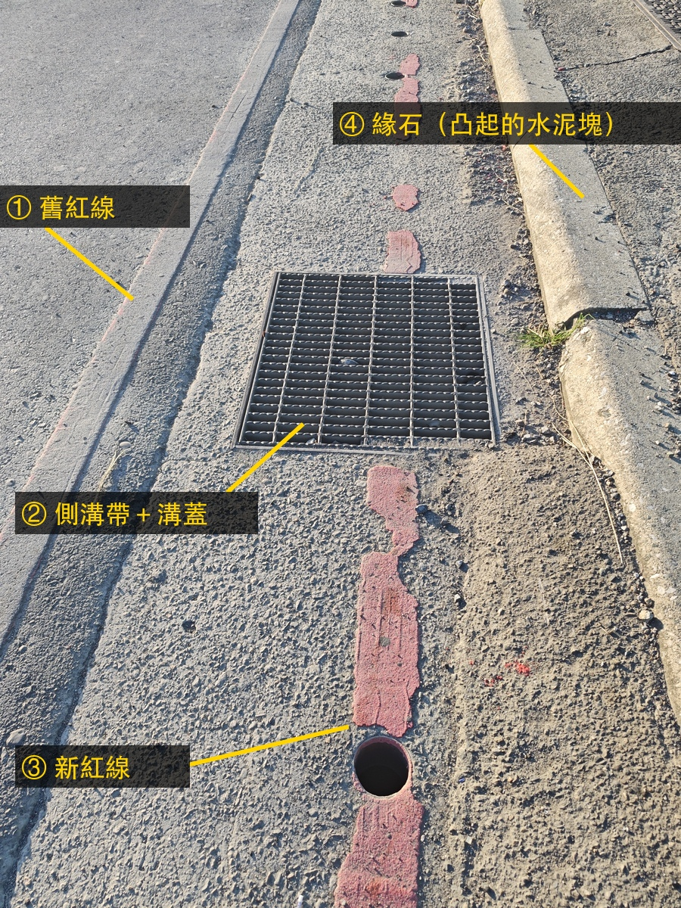

# How a metro works' traffic plan squeezed riders out: County Road 116 (Zhongzheng Road, Shulin)

Written in plain language. Each number is followed, in brackets, by its source file and uncertainty. This is not a judgement of who broke the rules. Which red line is the official one and which design speed applies are questions for documents; the ones to request are listed at the end.
Every figure produced by image recognition carries its method; the index is [`materials-2026-09-23.md`](materials-2026-09-23.md).

## The rider's complaint (in the rider's words, 22 September 2026)

> Before the island was painted over: you had to change lanes in a hurry, the lane shrank, and on a scooter you ended up riding the drain grates. **Seven of them.**
> After: the asphalt was dug out, and at night you can't see well. On the main road at night the view is poor, and right where the **asphalt dips** you meet **seven drain grates**, one after another.

Across the two periods, the constant is those seven grates. Before, the rider was pushed onto them by the rush to change lanes. After, the dug-out dip leads the rider onto them, at night, without being able to see.

## Timeline

| When | This stretch | Source |
|---|---|---|
| Nov 2022 | Month the works began. Two-way road, dashed lane lines, "50" painted on the road. No solid line, no painted island | Street View pano gnxxb317… (`results/solid_line_extent.json#/epochs`) |
| Sep 2024 | Under works. Double yellow line; no solid line before 49 m; cones and the island start at 49 m | Street View panos iKUYZ2…, pdYBYT… (±5 m) |
| 6 May 2025 → 30 Sep 2026 | Road excavation permit **New Taipei Metro Works 1140874494** (utility relocation for the metro): asphalt, 750 m long, 3 m wide, 1.2 m deep | `results/excavation_live_2026-09-22.json` |
| Jun 2025 | Double white solid line from 0 m, island from 35.5 m, main road climbs from 85 m. A yellow "30" is painted on the road. **The island is intact, not yet painted over** | `output/seq`, `output/seq/+0015.7.jpg` (±5 m) |
| About a year after Jun 2025 | About two thirds of the island painted over (54.9–68.3%); the red line repainted further out, onto the drain strip | `results/erasure_ratio.json`; the "Red line" section below |
| 20 Sep 2026 | I walked the stretch and took 42 photos (15:56–16:01) | `evidence/field-2026-09-20/MANIFEST.csv` |
| 23 Sep 2026 | 64 photos at dawn (06:30–06:34): top, front and side shots of each of the seven grates | `evidence/field-2026-09-23/README.md` |

## These 85 metres

**From the start of the solid line to the bridge is about 85 metres.** The whole stretch is limited to 30 km/h.

- **The first 35 m is a solid line: no changing lanes.** It starts about 40 m earlier (35–50 m) than it did in September 2024. (`solid_line_extent.json#/extents`, `#/epochs`)
- **The next 50 m is the painted island, and the lane narrows.** The Urban Road Design Specification, table 4.2.7 ("through-lane shift"), asks for **5:1** at 30 km/h and 16:1 at 50 km/h. (`docs/evidence.md` L19)

| | Taper | Against 5:1 at 30 km/h | Source |
|---|---|---|---|
| **Before painting over** (Street View, June 2025) | **4.0–5.1 : 1** | at the limit, or just short |  (Street View imagery is not published under Google's terms; this schematic is drawn from my own measurements) |
| **After** (20 Sep 2026, photo F40) | **about 12 : 1** (11.7–12.3) | passes |  |

- The before figure was measured directly on the 2025 Street View images: an edge is used only when two recognisers agree; the horizon was computed two independent ways (the vertical vanishing point from poles, and Street View's known camera pitch), which agree within about 1°; re-saving or cropping barely moves the reading.
- A second, independent route agrees: 12:1 after, with about two thirds painted over, implies about 4.3:1 before.
- Not yet resolved: the island's edge should run parallel to the lane, but on Street View it is 2.8–3.9° off. With that error included, the before range crosses 5:1, so this says "at the limit or just short", not "clearly short".
- **Painting over was an improvement.** After, 12:1 passes, which matches the rider's words: "it's better since they painted over it."
- **Withdrawn:** an earlier version said "about 10:1 (9.2–11.9)". That came from the program grouping different painted lines together, and could not be reproduced once the image was re-saved. The 9.2 was from F17, which looks up the bridge ramp where the ground is not flat, so plane geometry does not apply. (`isolation/taper-recheck/NOTES.md`)

## The red line: the old one was the real road edge

There are two red lines: (1) the **old red line**, worn, at the edge of the asphalt, and (3) the **new red line**, painted on (2) the drain strip and straight across the grates. They are **0.60–0.68 m** apart. (F30–F32 on 20 September measure 0.63–0.68 m, `results/redline_gap_F3x.json`; top-down shots at grate 2 on 23 September measure about 0.60 m, `isolation/field-2026-09-23/NOTES.md`. The ruler is the red line's own 10 cm width, checked with a bank card at 95–97 mm.) (4) The kerb is further out, a raised concrete strip.

What the rules say (checked word for word against the national law database; the Chinese originals are in [`evidence.md`](evidence.md)):

- **Road Traffic Signs, Markings and Signals Rules §169:** a no-temporary-stopping line "is drawn, as a rule, on the front or top face of the **kerb**; on a road without a kerb it may be marked on the road surface, about 30 cm from the edge." (`docs/evidence.md` L2)
  Here there **is** a kerb, yet the new red line is not on it, and the drain strip it is painted on is not the asphalt surface either.
- **Same rules §183:** the road edge line "indicates the edge of the shoulder or the outer edge of the road surface … it may be omitted … where a no-stopping or no-temporary-stopping line is drawn." (L20)
  Where there is a red line, no white edge line is needed, so **the red line itself marks the road's outer edge**.
- **Urban Road and Ancillary Works Design Standard §2(1):** "A lane is the part of the road delimited **by markings** or by physical means …" (L21)
  Wherever the markings go, the lane goes.

**So** (this is my reading, not the text of the law): moving the red line out by 0.6 m put the drain strip and its grates inside the "road". The asphalt a scooter can ride did not get any wider; only the lane on paper did. A rider who follows the markings rides onto the grates.

## The grates: the red line is painted right over them

- **Seven grates:** looking at the drain strip every 8 m along the road in Street View, the grates are at about 8, 16, 28, 44, 58, 74 and 82 m (±5 m). (`solid_line_extent.json#/drain_covers`) On 23 September I photographed all seven, placed along the road by timestamp. (`evidence/field-2026-09-23/README.md`)
- **Image recognition:** the 16 top-down photos of 23 September cover grates 1 to 6. **In all 16, the new red line's axis crosses the grate**, 1–14 cm from its centre. Grate 7 has no top-down photo. This result needs no scale. (Method printed under the figure; script `isolation/field-2026-09-23/cv_evidence.py`)
- **Open holes:** beside grates 4 and 5 there are uncovered round drain holes, about 8–11 cm across, 4–13.5 cm from the red line's axis.

### Slippery when wet, and a step

- **Highway Act §72(4)** (amended and promulgated 17 August 2026): manholes and handholes "shall, after installation or maintenance, be repaired and **backfilled flush with the adjacent road surface**, and the **skid resistance** of covers and other surface fittings shall not be below the standard set by the Ministry of Transportation"; within the warranty period, "a single-point **step measured with a 3 m straightedge shall not exceed ±0.6 cm**." (L22) The ministry's skid-resistance standard is **50 BPN** for covers of at least 900 cm² that are not sunk below the surface. (Highway Land Use Rules §14-1, as reported by the Central News Agency on 20 June 2026; the rule's text was not retrieved.) Each grate here is over 50 cm a side.
- **New Taipei road excavation review rules 6.0:** new-to-old pavement joints, a single-point step measured with a 3 m straightedge within ±0.6 cm. (`docs/source-ntpc-excavation-6.0.txt`)
- Both rules are about the same thing: covers must sit flush and must not be slippery. News coverage of the amendment framed it around scooters skidding and falling in the rain. (Central News Agency, 2 December 2025 and 20 June 2026; the legislative reasons were not retrieved.)
- **What I did not measure:** how slippery the grates are when wet and how far below the road they sit. Photos cannot tell; the step needs a 3 m straightedge on site and the grip needs a pendulum skid tester. Whether §72 covers drain grates, and whether this stretch is governed by the Highway Act or by urban-road rules, has not been confirmed.
- **What you can see:** in the side shots, along the joint between the asphalt and the drain strip there is a groove running with the road: the "asphalt dip" in the rider's words. (Side shots P14–P18 and P25–P27, grates 2 and 3, 23 September)

## Low sun in the morning, and night

- **Glare:** heading to the bridge, on about **86 days** a year (mid-November to the end of January) between **07:00 and 08:00**, the sun is low (below 15°) and within ±25° of straight ahead: commuting time. Heading the other way, never. (`isolation/glare/sun_glare.py`; the road bearing is taken from the Street View heading and may be off by a few degrees; the glare threshold is my own choice, not a standard.)
  At dawn on 23 September, when the photos were taken, the sun was 47° to the left of the direction of travel, so not head-on.
- **Night:** the rider reports poor visibility. There are no night photos yet, and no street-lighting data.

## On a scooter here

The right is closed (red line, grates, open holes). The left cannot be crossed on the solid stretch (§167, no-lane-change line, `evidence.md` L1). The only place to move left is the 50 m of island, and it keeps narrowing.

| Speed | Solid stretch | Island stretch | Left after 2.5 s reaction |
|---|---|---|---|
| **30 km/h** (the limit) | 4.3 s | 5.9 s | **3.4 s** |
| 50 km/h (the limit before the works) | 2.6 s | 3.6 s | 1.1 s |

(`results/merge_window.json`; reaction time AASHTO 2.5 s, `results/reaction.json#/piev_s`. The 3.4 s **already has the reaction time taken off**.)

## Stacked together

Each one, on its own, sits at the edge of a limit:

1. **Left:** before painting over, the taper was about 4–5:1, right at 5:1 for 30 km/h; the solid line can't be crossed, and only 3.4 s are left to merge.
2. **Right:** the red line moved out 0.6 m and put seven grates and open drain holes inside the "road". §169 puts a red line on the kerb, §183 makes the red line the road's outer edge, and Design Standard §2 says the lane goes where the markings go.
3. **Underfoot:** the law says covers must be flush and not slippery (Highway Act §72), but whether these are has never been measured.
4. **Beside:** metro utility works, a 750 m permit.
5. **Time of day:** on winter commuting mornings, the low sun ahead; at night, poor visibility.

But all of it lands on the same 85 metres and the same rider: no crossing on the left, grates on the right, the lane narrowing in the middle, and the sun in your eyes. **No single rule is broken here. The design stacks several things to avoid onto the same stretch of road.**

## What I can't do, or haven't done

- The step and the wet grip of the grates: photos cannot measure them; they need a 3 m straightedge and a pendulum tester on site.
- Night: no photos.
- The taper before painting over: the edge-direction self-check is 2.8–3.9° off, unresolved.
- Grate sizes: with the worn red line as a ruler the readings disagree (55–88 cm), so they are not cited.
- Illegal parking: visible in photos, not counted.
- Effective lane width (how much a scooter can actually use): no number yet.

## Documents to request

1. New Taipei City Traffic Department: the **approved marking-change letter and marking drawings** for County Road 116, Zhongzheng Road (Shulin section), to settle which red line is official and why the solid line starts earlier.
2. New Taipei City Government (Department of Rapid Transit Systems / Public Works): the **traffic management plan and construction drawings** for permit 1140874494, to settle the design speed and whether the drainage works extend to this stretch.
3. Shulin District Office, Public Works Section: the **as-built drawings of the drain works and the cover test reports**, for the covers' specification, skid resistance and step against the road.
4. The responsible authority: whether this stretch is governed by the **Highway Act** or by **urban-road** rules, which decides whether Highway Act §72 applies.

(Legal basis: the Freedom of Government Information Act; see `isolation/EXTERNAL_34.md`.)
