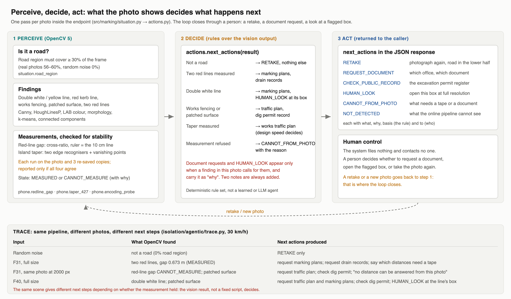

# Technical report

**Seven drain grates in 85 metres: measuring one road's markings from a phone photo, with OpenCV 5 on AWS**

Entry for the OpenCV AI Competition 2026. One author. 23 September 2026.

Video: https://youtu.be/jNofo20hvyY · Code and evidence: https://github.com/jiarong0423/jiarong0423-road-marking-conformity

---

## 1. Problem

On County Road 116 in Shulin, New Taipei, the lane approaching a bridge is squeezed from both sides within 85 metres:

- a double white line (35 m) forbids changing lanes,
- a painted island (50 m) narrows the lane from the left,
- on the right, a drain strip with seven steel grates runs the whole way, and in 2026 the red no-stopping line was repainted 0.6 m further out, onto that strip.

None of these is obviously illegal on its own. Each sits near a limit that is written down somewhere: a marking rule, a design table, a statute on manhole covers. Checking any of them today means sending someone with a tape measure. The question this project asks is narrower than "is this road safe": **from ordinary phone photographs, what can be measured against those written limits, how sure can we be, and what should happen next?**

## 2. Users

- **A rider** who uses the road and wants to know whether what they feel can be shown, and what to ask for.
- **A reviewer at a traffic department** who receives that request and needs numbers with their method and uncertainty, not adjectives.

The output is written for both: a plain-language scenario, itemised findings with the rule behind each, and a list of documents to request.

## 3. Architecture


**Online** (`aws/handler.py` → `src/marking/situation.py:assess`), on AWS Lambda (arm64 container, `opencv-python-headless==5.0.0.93`) behind an API Gateway HTTP API:

1. **Is it a road?** The road region must cover at least 30% of the frame (real photos 55.5–60.0%, random noise 0.0%). Otherwise the system measures nothing and asks for a retake.
2. **First-pass checks** (double white/yellow lines, kerbside red line, works fencing, patched surface, a rough taper ensemble). These point to regions worth opening; their counts are not cited as evidence.
3. **Measurements** (`src/marking/phone.py`): the red-line gap and the island's taper ratio (Section 4).
4. **Four-encoding gate** (`phone.encoding_probe`): each measurement runs on the photo as received and on JPEG re-encodes at quality 97, 94 and 91, and is reported only if all agree (red line within 5 cm, taper within 10%).
5. **Site notes**: the published numbers for this stretch are attached to every response, marked as not measured from the photo sent. They are generated from `results/` by `scripts/build_site_dossier.py`; a test fails if they drift.
6. **Next actions** (`src/marking/actions.py`): which document to request from which office, which box in the photo to open, and what the photo cannot answer. Document requests and "open this box" actions appear only when a finding in the photo calls for them, and each carries that finding. Two notes are always included: what a photo cannot answer, and that grates are not detected online.

**Offline** (`isolation/`): the evidence pipeline behind the story's figures. Every figure made by image recognition has its method printed under it and is indexed in [`materials-2026-09-23.md`](materials-2026-09-23.md).

## 4. Implementation

### 4.1 Red line over the grates (`isolation/field-2026-09-23/cv_evidence.py`)

| Step | OpenCV | Detail |
|---|---|---|
| Grate | `morphologyEx` (close 45 px, open 61/151/251 px), `connectedComponentsWithStats`, `minAreaRect` | gap pixels grey < 45 (measured: gaps 10–51, the concrete's darkest tenth 57–92); near-rectangular (fill ≥ 0.75, aspect 0.5–2) |
| Grate check | numpy FFT on row/column means | bar periodicity peak/mean ≥ 6, at full resolution (an earlier detector inverted this test at one-third resolution) |
| New red line | `cvtColor` to LAB, `connectedComponentsWithStats`, `fitLine` | a* at least 12 above the frame median; strips touching the frame edge or thinner than 1:6 are the old line and are excluded |
| Open holes | `findContours`, `minEnclosingCircle` | darkest 6%, circularity > 0.6, diameter 5–25 cm |

Result: in **16 of 16** top-down photos (grates 1–6) the new red line's axis crosses the grate, 1–14 cm from its centre. This needs no scale.

### 4.2 The ruler, and the red-line gap (`src/marking/phone.py:redline_gap`)

A red no-stopping line is 10 cm wide by regulation (§169). The gap from the intact line's inner edge to the worn line's centre is measured with a cross-ratio against the vanishing point of the cross-road direction, using that 10 cm as the ruler. No camera pitch, roll or height is needed. The ruler was checked with an ID-1 card (85.60 mm) laid across the fresh paint: **95–97 mm** (`isolation/field-2026-09-23/card_vs_redline.py`).

Result: **0.63–0.68 m** on three photos of 20 September (F30–F32), **about 0.60 m** at grate 2 on 23 September from top-down shots.

### 4.3 The island's taper (`isolation/taper-recheck/`, `isolation/overlay-2025/`)

The taper ratio is the ground angle between the island's two edges. Two independent recognisers must agree on each edge: outermost white paint per 12 px slice with a RANSAC line, and EDLines (`cv2.ximgproc`), within 1° and 15 px. The horizon comes from the vertical vanishing point (poles, walls). A self-check requires the lane-side edge to meet the horizon at the road's own vanishing point.

| | Ratio | Against 5:1 at 30 km/h (design table 4.2.7) |
|---|---|---|
| Before repainting (Street View, June 2025) | 4.0–5.1 : 1 | at or just short of the limit |
| After (phone, F40, September 2026) | about 12 : 1 (11.7–12.3) | passes |

The before figure was also computed with the horizon from the Street View request's known pitch; the two horizons agree within about 1°. A third, independent route agrees: 12:1 after, with about two thirds of the island painted over (`results/erasure_ratio.json`), implies about 4.3:1 before.

## 5. Evaluation, including what failed

**A published number was withdrawn.** The project first reported the taper as "about 10:1 (9.2–11.9)". On 23 September the measurement was repeated on 13 photos under seven perturbations (three JPEG qualities, three crops). The original method produced a reading on 7 of 91 runs, ranging 5.0–23.2. Drawing what it picked showed why: the two "edges" it measured were mixtures of different painted lines grouped by a shared vanishing point, not the island's two edges (`isolation/taper-recheck/f40_picks.jpg`). The 10:1 is withdrawn. The consensus method in 4.3 replaced it, and the four-encoding gate was added to the endpoint so that a number which moves with a re-save is never reported.

**Refusals are counted, not hidden.** F17 (looking up the bridge ramp) fails the self-check on every perturbation and is refused: the ground there is not a plane. On F40, one of seven perturbations fails the self-check and is dropped.

**Perturbation results** (F40, after repainting): as received 12.1; JPEG 97, 91: 11.8, 11.7; crops of 8, 16, 24 px: 12.3, 12.2, 11.7. One run rejected (JPEG 94: 8.4, self-check off by 29°).

**Other things tried and dropped**, each recorded in the notes: SIFT registration of Street View onto the phone photos (15 inliers of 69; the two views cover different parts of the island), LSD in place of Hough (less stable), the horizon from the stripe pattern (stripes too short), black-hat and background-relative grate finders (fooled by rough concrete).

**Provenance.** `results/figure_registry.json` pins each published figure to the file and key that produced it; `scripts/check_figures.py` reports **73 published figures match their sources**. Test suite: **212 passed**.

**What is not measured.** The step between grate and road and its skid resistance (the Highway Act §72 sets 6 mm and a skid-resistance floor; a straightedge and a pendulum tester are needed on site), anything at night, and the lane width a scooter can actually use. No figure has field-measured ground truth; the card is the only physical reference.

## 6. Deployment and reproduction

```sh
pip install -r requirements.txt                                    # opencv-python 5.0.0.93, numpy 2.4.4, scipy 1.17.1
python3 -B -m pytest -q -p no:cacheprovider                        # 212 tests
python3 -B scripts/check_figures.py                                # 73 figures vs. their sources
AWS_REGION=ap-southeast-2 ACCOUNT=<account> ./aws/build-and-push.sh v12
```

The container pins `opencv-python-headless==5.0.0.93` and `numpy==2.5.3` (`aws/Dockerfile`). The local interpreter that produced `results/` has numpy 2.4.4; the container was tested separately with 2.5.3 (below).

**Measured in the v12 container** (arm64, 2 CPUs, locally): a 2000 px photo takes 14.3 s and the new measurements refuse (they need full resolution); a full-resolution photo (JPEG 90, 2.2 MB) takes 52.5 s and returns the red-line gap 0.668 m on F31. That exceeds API Gateway's 30 s limit, so the deployment raises Lambda memory to 10 GB (more vCPUs). Error paths return clear answers: malformed JSON or a missing photo 400, over 3 MB 413, a non-road photo `NOT_A_ROAD_PHOTOGRAPH`. Live since 23 September: image v13 at 3008 MB, the account's current memory cap. Measured live at 3008 MB: a 2000 px photo takes 25.6 s and the new measurements refuse; a full-resolution photo times out at 60 s, so the full-resolution path needs a 10 GB limit increase from AWS. POST requires an access token (`x-access-token`), given to judges with the submission; the API is throttled to 1 request/s with bursts of 3, and a $5 budget alert is set. See [`deployment.md`](deployment.md).

## 7. Regulations used

The Chinese originals are quoted word for word from the national law database in [`evidence.md`](evidence.md); the database states that where English and Chinese differ, the Chinese prevails. Highway Act §72 has an official English translation, which the story quotes; the other clauses have none that I could find, and their English wording here and in the story is my own, unofficial translation.

- Road Traffic Signs, Markings and Signals Rules §169 (red line on the kerb; 10 cm wide), §183 (a red line stands in for the road edge line), §167 (no lane change)
- Urban Road and Ancillary Works Design Standard §2(1) (a lane is what markings delimit)
- Urban Road Design Specification, table 4.2.7 (lane shift 5:1 at 30 km/h, 16:1 at 50 km/h)
- Highway Act §72(4) (covers flush within ±0.6 cm on a 3 m straightedge; skid resistance not below the ministry's standard)
- New Taipei road excavation review rules 6.0 (patch joints ±0.6 cm)

Two clauses quoted by an AI assistant during this work (Design Standard §14 and §16 on gutters and flush covers) do not exist in the official text and are not used.

## 8. Perceive, decide, act (Agentic Vision)



The vision result decides what the system returns next (`src/marking/actions.py`, called inside `assess()`). It is a deterministic rule set over the OpenCV output, not a learned or LLM agent; the loop closes through a person, who decides whether to retake the photo, request a document or open a flagged box.

**Trace** (`isolation/agentic/trace.py`, 30 km/h, the endpoint's own function):

| Input | What OpenCV found | Next actions produced |
|---|---|---|
| Random noise | not a road | RETAKE only |
| F31, full size | two red lines, gap 0.673 m (MEASURED) | request marking plans; request drain records; which distances need a tape |
| F31, the same photo at 2000 px | red-line gap CANNOT_MEASURE; patched surface | request traffic plan; check dig permit; no distance can be answered from this photo |
| F40, full size | double white line; patched surface | request traffic plan and marking plans; check dig permit; HUMAN_LOOK at the line's box |

The same scene at two resolutions gives different next steps, because the measurement held at one and not the other: the vision output, not a fixed script, decides.

**Failure handling and observability.** A non-road photo stops at the first gate and asks for a retake. A measurement that moves when the photo is re-saved is refused with its reason, and the refusal becomes a CANNOT_FROM_PHOTO action instead of a number. Every action carries `why` (the finding that caused it), `basis` (the rule) and `to` (who acts). Document requests and HUMAN_LOOK appear only when a finding calls for them; two notes (what a photo cannot answer, and that grates are not detected online) are always added. The system files nothing and contacts no one.

**Evaluation on 20 evidence photos** (`isolation/agentic/evaluate.py 10`: every k-th photo, 10 from each field batch, full resolution, 30 km/h):

| | Result |
|---|---|
| Photos assessed (none refused as non-road) | 20 / 20 |
| Actions consistent with the findings that should cause them (document request, record check, HUMAN_LOOK), plus the two standing notes | **20 / 20** |
| Every action carries a `why` | yes |
| Distinct sets of next actions produced | 4 |
| Photos with a document request / HUMAN_LOOK | 15 / 16 |
| Red-line gap or taper reported | 0 / 20 |

What this shows and does not: the decision step follows the vision output exactly, and different photos lead to different next steps. It does **not** show the findings themselves are correct: the first-pass red-line detector fires on 16 of 20, and opened by eye it has been wrong on 13 of 23 earlier frames, which is why its action is "HUMAN_LOOK: open this box" and never a conclusion. None of the 20 sampled photos is one of the three frames (F30–F32) where the red-line gap was measured, and the close-ups of 23 September are not the geometry that measurement is built for, so the new measurements refuse on all 20; they are demonstrated in the trace above instead. Run time on this machine with four photos in parallel: median 117 s per photo (a single photo alone takes about 36 s). The full 106-photo run was stopped after 34 minutes and is not reported.

## 9. Responsible use

- **It describes, it does not accuse.** The output never says a rule was broken. It reports what was measured, against which written limit, how sure the measurement is, and what it could not measure; deciding which rule applies is left to the documents it asks for.
- **It refuses rather than guesses.** A photo that is not a road gets no measurement. A measurement that changes when the photo is re-saved is not reported. Every refusal says why.
- **Privacy.** Uploaded photos are processed in memory and not stored; nothing from a request is written to logs beyond Lambda's standard request record. In the published evidence, five licence plates are blurred, no photo carries a GPS fix, and close-ups show pavement only.
- **Data rights.** Google Street View imagery was used to measure the island before it was repainted, but no Street View image or derived image is published, per Google's terms; the published schematic is drawn from the project's own measurements. The published photos are the author's own.
- **Operation.** POST requires an access token; the API is throttled (1 request/s, bursts of 3); the account's Lambda concurrency is capped at 10; logs are kept 14 days; a budget alert is set. The token is not in the repository.
- **Human in the loop.** The system's last step is a list of documents for a person to request and boxes for a person to look at; it takes no action on its own.

## 10. Limitations and data rights

- One road, one author, 106 photos. The method is general; the evidence is local.
- The before-repainting taper was measured on Google Street View imagery. Google's terms prohibit sharing screenshots or data derived from Street View, so no Street View image is in this repository; the published schematic is drawn from the project's own measurements.
- Five photos have licence plates blurred; no photo carries a GPS fix.
- The taper after repainting rests on one photo (F40).
- Which red line is official, and which design speed applies, are questions for documents. The system's last step is to request them.
